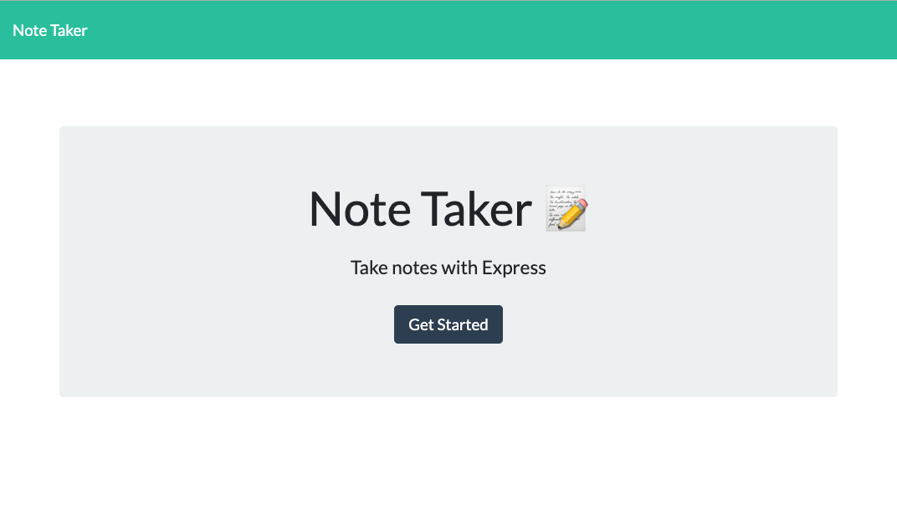

# Notepad
This application can be used to write, save, and delete notes. This application uses an express backend which lets you save and retrieve note data from a JSON file.

This app if for users that need to keep track of a lot of information, it's easy to forget or be unable to recall something important. Being able to take persistent notes allows users to have written information available when needed.

# Technologies
-Javascript  
-Node.js  
-Express Server

